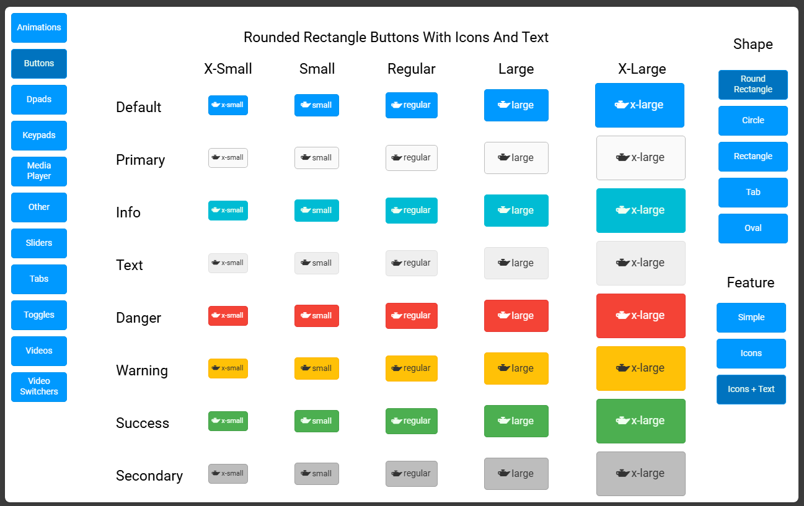
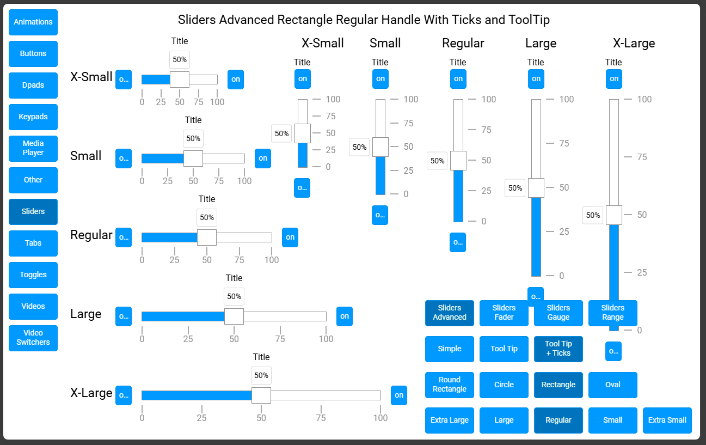
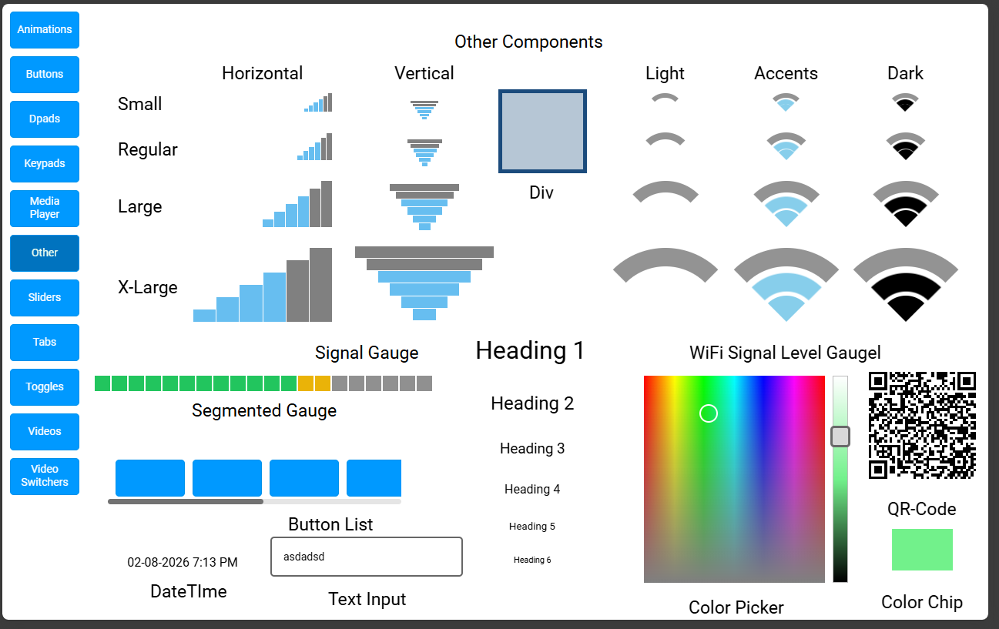

# Construct Themes Showcase

A Crestron Construct project showing all possible UI elements that can be configured by the [Theme Editor](https://sdkcon78221.crestron.com/downloads/ShowcaseApp/index.html?showThemeEditor=true).

You can use it to view the default Crestron Themes. This project supports the Cretron Provided Light and Dark Themes.  You can switch between them at runtime using the menu. To add a different theme, open the project in construct and assign a different theme to it, recompile and re-load

This project is way passed the [Best Practices For Project Design](https://help.crestron.com/construct/Content/Topics/Best-Practices/Design%20Best%20Practices.htm) and [Performance Optimization](https://help.crestron.com/construct/Content/Topics/Best-Practices/Performance-Optimization.htm). It was designed with as many Pages as necessary to lower the impact on both the touch panel or the browser due to the many widgets and objects. 

Preloading and Caching was turned off.  The pages are too big for the browser or the panel to hold the whole project in memory. Pages will take a while to load.


> [!WARNING]
> This projet is too big. Loading the CH5z in a touch panel will result in very slow performance or even crashing. For best results (still not ideal) upload the CH5z in a series 4 processor under **Web Pages and Mobility Projects** as a CH5 XPanel.

# How to use

In the Release section of this repository you will find the Pre-Compiled Construct Project (CH5z) as well as its SIMPL Compile Proeject (LPZ).  Load the LPZ in a series 4 processor, and the CH5z in the processor under **Web Pages and Mobility Projects** as a CH5 XPanel.

You can try loading the CH5z in a TouchPanel, but performance will be even more sluggish.

# Screen Shots

Below are some screenshot of the showcase using the Light Theme







# Observations made while working on this projects

## HTML Text and Heather objects

They don's seem to belong to any kind of theme, so when switching between light and dark, both the background and font color remain the same.  This does not look good on the Dark Theme.

Also the Heading option seem to have very small font sizes with the default themes. Not much of a heading.

## Slider Advanced Ticks

Ticks need to be entered exactly as explained [here](https://sdkcon78221.crestron.com/downloads/ShowcaseApp/ch5-slider/ticks.html):

```
Defines the ticks on the slider. The value should be a valid JSON string.

The slider uses advanced tick scales: non-linear or logarithmic.

Sliders can be created with ever-increasing increments by specifying the value for the slider at certain intervals.

The first value defines the % position along the length of the slider scale to place a tick mark.
The second value is the label value to place next to the tick at that position.
An example would be ticks='{"0":"-60", "25":"-40", "50":"-20", "75":"-10", "100": "0" }'

When using ticks, attributes like min, max, and step are ignored.
```

It would have been nice if it could figure it out from min, max, and step automatically. But I guess this is necessary to accommodate for non-linear scales.

## Slider Advanced 

The Slider theme does not support theming the following slider component
* Slider Button (ON OFF)
    * Button Style
    * Shape
    * Label
* Slider Title
    * Content

## Miscelaneous

* The theme editor has some elements with no immediate equivalent in construct:
    * ch5-Form
    * ch5-modal-dialog
    * ch5-overlay-panel
    * ch5-select
    * ch5-subpge-reference-list
    * ch5-triggerview

# Versions

## Construct Version
* Crestron Construct: 2.801.22.00
* User Interface Plugin: 1.4401.12.0
* CH5 Version: 2.17.0

## SIMPL Version
* SIMPL Version: 4.30
* SIMPL+ Version: 4.06
* INCLUDE4.DAT Version 2.21.184
* Device Database Version: 200.43500.001.00
* Crestron Database Version: 228.3500.001.00
* Crestron Toolbox Version: 3.1360.0013.8
* SIMPL+ Cross Compiler Version: 1.3

## Windows Environment
* Windows OS: Windows 11 Pro (OS Build 26200.7705) 
* Processor: 12th Gen i7-1255U, 2600 Mhz, 10 Cores
* Memory: 32GB

